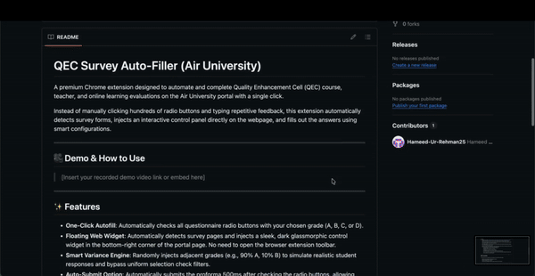

# QEC Survey Auto-Filler (Air University)

A premium Chrome extension designed to automate and complete Quality Enhancement Cell (QEC) course, teacher, and online learning evaluations on the Air University portal with a single click.

Instead of manually clicking hundreds of radio buttons and typing repetitive feedback, this extension automatically detects survey forms, injects an interactive control panel directly on the webpage, and fills out the answers using smart configurations.

---

## 🎥 Demo & How to Use

⭐ **If this extension saves you time, please star this repository!**

Watch the step-by-step video guide on how to load and use the auto-filler:

  <a href="https://drive.google.com/file/d/1ZMfEJ7VXsgqeUF-6zcu0QusMqxj7bzb2/view?usp=sharing" target="_blank">
    
      
    <h3>▶️ Click Here to Watch the Full Video Demo with Audio</h3>
    
  </a>

---

## ✨ Features

- **One-Click Autofill**: Automatically checks all questionnaire radio buttons with your chosen grade (A, B, C, or D).
- **Floating Web Widget**: Automatically detects survey pages and injects a sleek, dark glassmorphic control widget in the bottom-right corner of the portal page. No need to open the browser extension toolbar.
- **Smart Variance Engine**: Randomly injects adjacent grades (e.g., 90% A, 10% B) to simulate realistic student responses and bypass uniform selection check filters.
- **Auto-Submit Option**: Automatically submits the proforma 500ms after checking the radio buttons, allowing you to cycle through evaluations rapidly.
- **Sentiment-Based Comment Generator**: Automatically drafts and writes distinct, randomized comments about the instructor and the course depending on the grade selected:
  - **A (Strongly Agree)**: Positive, encouraging statements.
  - **B (Agree)**: Generally supportive comments.
  - **C (Disagree)**: Constructive, actionable feedback.
  - **D (Strongly Disagree)**: Critical feedback highlighting improvement areas.
  - *Note: If a form only has a single comment box, the extension automatically merges both instructor and course feedback into a single paragraph.*

---

## 📋 Compatibility

The extension is fully compatible with the following Air University QEC portal pages:
- **Student Course Evaluation Questionnaire** (`p1.aspx`)
- **Teacher Evaluation Form** (`p10.aspx`)
- **Online Learning Feedback Proforma** (`p10a_learning_online_form.aspx`)

---

## 🚀 Installation Guide (How to download and use)

Since this extension is shared on GitHub and is not listed in the public Chrome Web Store, you can install it manually in **Developer Mode**:

### Step 1: Download the Extension
1. Click the green **Code** button at the top of this GitHub repository page.
2. Select **Download ZIP**.
3. Extract the downloaded `.zip` file to a folder on your computer (e.g., your Desktop).

### Step 2: Load it into Google Chrome
1. Open Google Chrome and go to the Extensions page by typing `chrome://extensions/` in the URL search bar.
2. In the top-right corner of the Extensions page, switch **Developer mode** to **ON**.
3. Click the **Load unpacked** button in the top-left corner.
4. Select the extracted folder containing the extension files (the folder that has `manifest.json` inside it).

### Step 3: Run the Auto-Filler
1. Navigate to the Air University QEC Survey System page:
   `https://portals.au.edu.pk/QEC/p1.aspx`
2. You will see a dark floating control panel slide into view in the bottom-right corner.
3. Select your desired grade, toggle **Smart Variance** or **Auto-Submit** if desired, and click **Fill Survey Questionnaire**.

---

## 🔒 Privacy & Security
- This extension runs **entirely local** in your browser.
- It does not collect, track, store, or transmit any personal data, portal credentials, or web browsing history off your device.
- All configurations are saved locally using the secure `chrome.storage` API.
